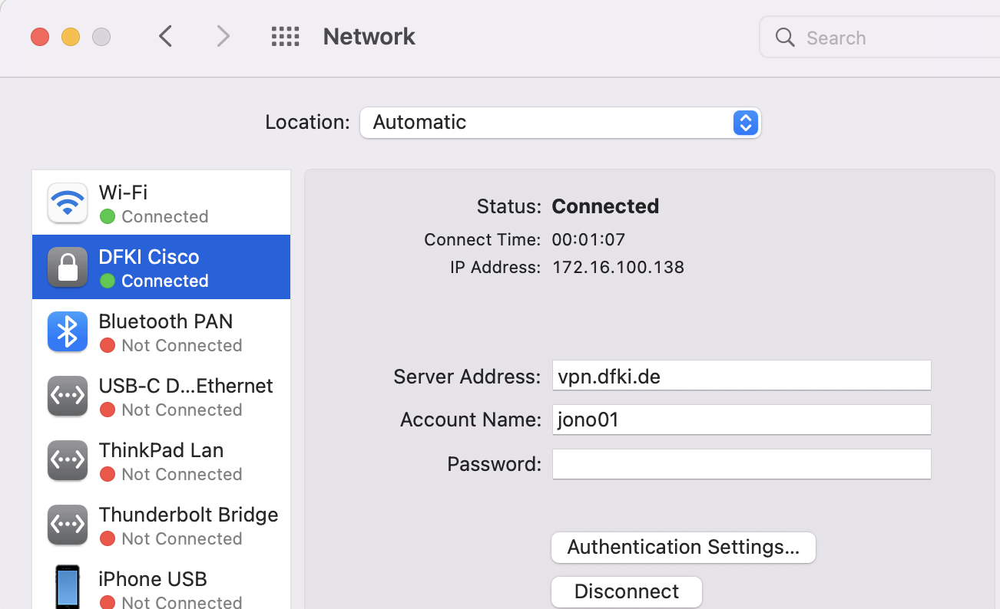

## News/Updates 
New dataset and model available that now allows to infer text to the first 16 SDGs! F1 score further improved to 92% by only using labeled datapoints where the agreement score of annotators was at least 70%.

Model can be found here:
[Fine-tuned Bert SDG Classifier for the first 16 SDGs](https://huggingface.co/jonas/bert-base-uncased-finetuned-sdg)

# About 
Machine Learning models for classifying text according to the first 16 Sustainable Development Goals. 
Data comes from the amazing https://osdg.ai/ community! 

The aim would be to also add SDG 17, however, according to the authors high-quality training data is very difficult to obtain. If you would like to contribute with the continous data collection, or have high-quality training data in mind, please get in touch with the OSDG team. 

# Fine-tuned deep learning models:

This Repo contains the code to easily fine-tune a transformer model on the training data. Note that in the src folder you also find a python script to apply hyperparameter tuning using [Wandb](https://wandb.ai/site)

There have been two recent publications:

* Multi-class BERT classification model together with the dataset used for training and metrics is available on HuggingFace Modelhub: [Fine-tued BERT SDG Classifier](https://huggingface.co/jonas/sdg_classifier_osdg)


* UPDATE March 2023: Re-trained Bert multi-class classification model with optimised hyperparameters and better performance on the evaluation datasets, can now be downloaded and used from HuggingFace Modelhub: [Fine-tuned Bert SDG Classifier with optimised hyperparameters](https://huggingface.co/jonas/bert-base-uncased-finetuned-sdg-Mar23)

# Use it for your down-stream tasks:

One example on how to apply the SDG text classification model is to assess the distribution of SDGs in policy documents. A prototype web application can be found here:
https://huggingface.co/spaces/jonas/sdg-policy-tracing

To simply thest the classifier, you may use this web application: https://huggingface.co/spaces/GIZ/sdg_classification

Please get in touch if you would like to learn more, contribute or need advice on how to employ the models. 

## Citation

If you find any of the models useful in your application, please cite the following:

```
@misc{Nothnagel2023SdgTextClassification,
  author = {Nothnagel, Jonas},
  title = {sdg_text_classification},
  year = {2023},
  publisher = {GitHub},
  journal = {GitHub repository},
  howpublished = {\url{https://github.com/jonas-nothnagel/sdg_text_classification}},
}
```

# Documentation on how to run and train the models on DFKI computing cluster

# Documentation - Getting Started

Before you get started with running your code and training models you need to sort out two things:

1. Set-up and connect to the **DFKI VPN**. Create your account following this guideline:
    
    confidential - upon request
    
    
    
2. Create your computing cluster account following this guideline:
    
    confidential - upon request
    

After this you should have following credentials:

- DFKI Credentials for VPN (*username & password).*
- DFKI Computing Cluster Credentials (*username & password).*

*It is a good idea to create a **Github** account as well if you do not already have one. We will need it to version control our code and projects.* 

# Connect to the remote server

Now we can connect to the remote Server. Note that the server runs on Linux, so you should get familiar with simple Linux Terminal commands.

1. Connect to VPN as shown above.
2. Open terminal on your local machine and *ssh* into remote server using your Computing Cluster Credentials (username and password):
    
    *ssh USERNAME[@serv-6404.kl.dfki.de](mailto:nothnagel@serv-6404.kl.dfki.de)*
    
3. Optional: Check if GPUs are running:
    
    *srun -K --container-image=/data/enroot/nvcr.io_nvidia_pytorch_22.05-py3.sqsh --gpus=8 nvidia-smi*
    

You should see this:


# Overview of components

Usually we will work with three components:

- Github/Gitlab for version control
- The remote server for storing large files and running jobs on GPUs.
- Our local machine (laptop) for code development and repo set-up.

Below you find an example visualisation how these components work with each other and interact. 


# Set-up your development environments:

Before jumping in the fun part - model training - we should take some time to properly set-up and connect the components mentioned above. The following steps are only one way to do it. Feel free to do it as it works best for you!

**Example Workflow:**

1. Create your repo with a consistent folder structure on your local machine.
2. Push this repo to Github/Gitlab. IMPORTANT: Include large folders/files in the gitignore. We do not want to push our datasets (if they are large) and trained models to github but keep them only on the remote server!
3. *ssh* into the remote server and *git clone* the repo from Github/Gitlab on the server in the file directory of your choice: This will most likely be in /data/USERNAME/
4. If the dataset is not on github (for instance if it is larger than 100MB), *scp* the large files (raw data mostly) from your local machine to the remote server. Put it, for example, under /data/USERNAME/PROJECT_FOLDER. 
*Advanced: Create a new data, models folder in the cloned repo and scp the large files directly there. You MUST specify the gitignore accordingly then. Easier to just drop the data in a separate folder on the remote server and mount this folder when training.*

—> Now you have set up the base structure. 
You have a Repo pushed to Github for version control. **✓** 
You have the data and repo on your local machine for code development. **✓** 
You have the repo on the remote server to pull changes and run the code with the datasets and GPUs. **✓** 

 **Workflow to stay in sync:**

1. Develop code in your IDE. 
2. Push new commits from local machine to Github. This is the usual workflow without interacting with a remote server for model training. 
3. Keep the repo on the remote server up-to-date by pulling changes from Github to remote server. 

*Note:* 

- If there are any large files that should not enter Github. *scp* them directly from local machine to remote server.
- If raw data has to be transformed and it needs GPU support (or you simply decide to run all jobs on the remote machine which is recommended), run it on the remote server and directly put it in a data folder there.

# Sending data and files to remote server

We want to store our large raw and processed datasets as well as trained models only on the remote server (remember, that is why we need to specify the gitignore). But first we need to send it the remote server. For this we use *scp.*

We want to use our assigned data folders which can be found under:

*cd data/USERNAME* 

then we may create a sub-folder for datasets such as

*mkdir test_data_folder (rmdir* or *rm -rf* for removal)

Then to transfer data from your local machine you must open the *terminal* on your local machine, We may simply use *scp* to send secure copies to the servers. The command is the following:

*scp -r local_file_path ssh destination* 

the destination is the DFKI server and the file path you want to specify, for example using the folder created above it would be:

*ssh* [nothnagel@serv-6404.kl.dfki.de](mailto:nothnagel@serv-6404.kl.dfki.de)*:/data/USERNAME/test_data_folder/*

and the full command would be 
*scp -r local_file_path ssh USERNAME[@serv-6404.kl.dfki.de](mailto:nothnagel@serv-6404.kl.dfki.de):/data/USERNAME/test_data_folder/*

# Sending data from remote server to local machine

This is a bit more tricky, at least on Mac where I tried it. Note that you basically have two options how to do this:

1. If you want to pull a file from a remote machine to your local machine
    
    `scp testuser@remote-host:/path/to/file/you/want/to/pull /path/on/local/machine/to/place/file`
    
2. If you are logged into a remote machine and want to push a file to your local machine (assuming you have the ability to scp to the local machine in the first place)
    
    `scp /path/on/remote/machine/to/file testuser@local-host:/path/on/local/machine/to/put/file`
    

Going with the second one, we need to obtain our local PCs IP address. I do this by typing in my **local** terminal:

```bash
ifconfig | grep inet
```

The obtained IP address is displayed like this:


And then sending files back to local machine we can for example run a command **on the remote machine logged in the DFKI network** such as:

```bash
scp /path/to_file/ [jonas@172.16.100.29](mailto:jonas@172.16.100.29):/Users/jonas/
```

# Understand the remote server structure

Once you are connected you can take a look at the folder structure:

*ls -1*


To see what pre-installed images contain packages we need we can *grep* them. For example to see all containers that have *pandas* pre-installed you can run:

*grep pandas /data/enroot/*.packages*


Now it is important to understand how the interaction between the images, your job and virtual environments. Generally we want to choose a container and run it. Whatever we do next is done within this container. 
This is important since we need to work inside these containers to ensure proper set-up and utilisation of the Nvidia’s GPUs. 

Here we run a slurm *srun* command to display all the pre-installed python packages within this container: 

```
srun \
  --container-image=/data/enroot/nvcr.io_nvidia_pytorch_22.05-py3.sqsh \
pip3 list
```


This is only the first few lines, we can see that there are a lot of preinstalled python packages. In the ideal case all your requirements and dependencies are already installed. Otherwise we will need to install additional dependancies for example with *pip install -r requirements.txt.* But this will be covered later.

# Running your code

Now we can do what we came for: Running our code on the remote server and utilising the GPUs. Let’s use this repo as an example:

[https://github.com/jonas-nothnagel/sdg_text_classification](https://github.com/jonas-nothnagel/sdg_text_classification) 

The repo contains code for fine-tuning a multi-class text classification model for classifying the Sustainable Development Goals using huggingface  and transformers. 

As explained above, connect to the remote server and *git clone* the repo into /data/USERNAME/

First, let’s simply compile a python script without GPU support.  Again, mount the container of your choice, but also specify where the Repository lies on the remote server. Since this is the place where we pushed all the code beforehand: here for example “sdg_text_classification”.

We choose the newest pytorch container:

```bash
srun \
  --container-image=/data/enroot/nvcr.io_nvidia_pytorch_22.05-py3.sqsh \
  --container-workdir="`pwd`" \
  --container-mounts=/data/nothnagel/sdg_text_classification:/data/nothnagel/sdg_text_classification \
  python ./src/test.py
```

Bashing

Now it is good practice to not copy paste these code lines into the terminal directly but to write a **[bash script](https://github.com/jonas-nothnagel/sdg_text_classification/blob/main/run_example.sh)** and compile it with

*bash run_example.sh*

```bash
#!/bin/bash
srun \
  --container-image=/data/enroot/nvcr.io_nvidia_pytorch_22.05-py3.sqsh \
  --container-workdir="`pwd`" \
  --container-mounts=/data/nothnagel/sdg_text_classification:/data/nothnagel/sdg_text_classification \
  python ./src/test.py
```

We want to do this because in the bash script we can specify the whole job, including:

- Creating/activating a virtual environment if necessary
- installing additional dependencies
- specifying the GPU support
- specifying experiment tracking and where to put results etc.

# Creating a helper script and running code

This is optional but good practice and will facilitate running scripts in the future. We will now create a utility script that uses our image by choice, all relevant folders (data and home) and specifies the current work directory: we call it *usrun.sh*

```bash
#!/bin/sh

set -xe

IMAGE=/data/enroot/nvcr.io_nvidia_pytorch_22.05-py3.sqsh
#IMAGE=/data/enroot/nvcr.io_nvidia_tensorflow_22.05-tf2-py3.sqsh

srun -K \
  --container-mounts=/data:/data,$HOME:$HOME \
  --container-workdir=$PWD \
  --container-image=$IMAGE \
  $*
```

We can simply comment out the images we do not want to use and use the image we want. Create this script, and put it in your /home/USERNAME/bin path. 

Then add it to path so you can simply run it without *bash:*

```bash
PATH=$PATH:~/home/USERNAME/bin
```

Alright, now let’s modify the *run_example.py* script since we do not need to specify images and mounts anymore and re-run it using our utility script.

The new *run_example.py* may look like this - we now also install some additional dependencies in the container and see if it works:

```bash
#!/bin/bash

pip install -r requirements.txt 
python ./src/test.py
```

Now putting it all together, we run the following command and check if the GPUs are working as well:

```bash
usrun.sh --gpus=1 bash run_example.sh
```

And it works!


# Next step: Utilising GPUs for training

*Note: If you run into permission errors, you may have to to make your bash scripts executable first. Simply run:*

```bash
chmod u+x your_sript.sh
```

Let’s run the minimal working example with support of 8 GPUs:

```bash
srun -K -N1 --gpus=8 --cpus-per-task=4 -p batch  \
--container-workdir=`pwd`  \
--container-mounts=/data/nothnagel/sdg_text_classification:/data/nothnagel/sdg_text_classification  \
--container-image=/data/enroot/nvcr.io_nvidia_pytorch_22.05-py3.sqsh  \
python ./src/test.py
```

Nice. It all works out!

## Fine-tune the transformer model

Now, let’s do what we came for and train our multi-class classification model! We have three components: 

- the [train.py](https://github.com/jonas-nothnagel/sdg_text_classification/blob/main/src/train_hyperparameter_tuning.py) function.
- the [bash script](https://github.com/jonas-nothnagel/sdg_text_classification/blob/main/job.sh) that installs all the requirements and starts the training script.
- the [bash script](https://github.com/jonas-nothnagel/sdg_text_classification/blob/main/run-job.sh) that contains the specification for the remote server and runs the job: What container,  how much RAM/GPUs/etc shall be used

For our experiments we will use [Wandb](https://wandb.ai/site) for tracking the experiments and subsequently run sweeps for hyper-parameter tuning. Using a tool such as Wandb is optional but highly recommended. It is good practice to get used to use such DevOps tool while building, training and testing models. 

***Add login tokens and credentials:***

- If you want to run the python scripts above without modification, you therefore need to create a Wandb account and provide your login credentials as indicated in the script. Otherwise, comment out the respective lines in the script.
- The same is true if you want to directly push your trained model to the [huggingface hub](https://huggingface.co/).

Store your login-tokens as *txt files* to read them in directly and do not push them by adding the folder in which they are nested to the *[gitignore](https://github.com/jonas-nothnagel/sdg_text_classification/blob/main/.gitignore)*. 

### Train the models

To train the multi-class classification model we cd in the cloned repo and run:

```bash
bash run-job.sh 
```

This will invoke the three components mentioned above and:

- train the model
- log all training details to Wandb and
- automatically pushes the best model on your huggingface hub

(if you provided your Login credentials in the [train.py](http://train.py) script). 

### Hyperparametertuning

In the [train.py](http://train.py) script you may notice that training parameters are given. Tuning this parameters and finding the optimal values for the problem at place is a common way to increase model performance. This is called hyperparameter-tuning. Basically we re-run the experiment with different combination of parameter values and log the results. Subsequently, we can find the best performing combination and re-train the model one last time with these optimal configuration and push it to the hub.

For hyperparmater-tuning we are using [wandb](https://docs.wandb.ai/guides/sweeps) again. To run hyperparameter tuning you can use the bash script as follows:

```bash
bash run-job-hyper.sh
```

If it ran successfully you will have a great overview of the training such as:


And obtain the best parameters:


As you can see we further improved our **f1-score** to over **91%**! Great!

And the model is pushed to the hub and ready for inference!

[https://huggingface.co/jonas/roberta-base-finetuned-sdg](https://huggingface.co/jonas/sdg_classifier_osdg)


## Screen your training

to create a screen simply type in

```bash
screen
```

Then start the training in the screen so you can also log off your ssh session and disconnect from the VPN. This is highly recommended when running long training jobs.

To de-attach the screen simply run

*ctrl+a+d (on mac).* 

to kill it:

*ctrl+a+k.*